## Abstract

This proposal introduces **The Talos Control Interface (TCI)**, a unified command-line interface and management system for the Talos ecosystem. TCI aims to simplify user interaction with various components through an intuitive and centralized interface.

## Motivation

The Talos ecosystem currently lacks a unified management interface, leaving users reliant on multiple tools and complex processes. TCI addresses these issues by providing a single interface for comprehensive management, increasing accessibility and user efficiency. This approach builds upon the simplicity provided by Satoshi Nakamoto in Bitcoin, while meeting modern ecosystem demands.

## Specification

### **1. Core Architecture**
- **Command-Line Interface**: Unified CLI for all Talos operations
- **Web Interface**: Optional web interface for visual management
- **API Layer**: RESTful API for programmatic access
- **Plugin System**: Extensible plugin system for custom commands
- **Configuration Management**: Centralized configuration management

### **2. Command Categories**
- **Node Management**: Commands for managing Talos nodes
- **Protocol Management**: Commands for managing various protocols
- **Economic Management**: Commands for economic operations
- **Governance Management**: Commands for governance operations
- **Monitoring and Analytics**: Commands for monitoring and analytics

### **3. User Experience**
- **Intuitive Commands**: Simple, intuitive command structure
- **Auto-completion**: Command auto-completion and help system
- **Interactive Mode**: Interactive mode for complex operations
- **Batch Operations**: Support for batch operations and scripting
- **Multi-language Support**: Support for multiple languages

### **4. Integration Points**
- **Protocol Integration**: Integration with all TIP protocols
- **Third-party Tools**: Integration with popular third-party tools
- **Cloud Platforms**: Integration with major cloud platforms
- **Monitoring Systems**: Integration with monitoring and alerting systems
- **Development Tools**: Integration with development tools and IDEs

## Rationale

The necessity for a unified control interface is crucial for simplifying complex system interactions, enhancing user engagement and effectiveness. Key benefits include increased accessibility for non-technical users, improved efficiency, and a significant enhancement in overall ecosystem management and adoption.

## Security Considerations

1. **Authentication and Authorization**:
   - Multi-factor authentication support
   - Role-based access control for users
   - API key management for secure interactions
   - Session management to ensure user data safety

2. **Data Security**:
   - Encrypted communication channels for secure data transit
   - Secure storage of sensitive configuration data
   - Audit logging for monitoring operations and accountability
   - Regular data backup and recovery processes

3. **System Security**:
   - Sandboxing to isolate plugin execution
   - Input validation to combat injection attacks
   - Implementation of rate limiting and DDoS protection
   - Routine security scanning for vulnerabilities and performance optimization

4. **Operational Security**:
   - Secure update mechanisms to deploy patches and improvements
   - Robust configuration management to maintain system integrity
   - Secure backup protocols for disaster recovery
   - Established incident response procedures for swift action against threats

## Implementation

```mermaid
flowchart TD
    A[Talos Control Interface] --> B[Command-Line Interface]
    A --> C[Web Interface]
    A --> D[API Layer]
    A --> E[Plugin System]
    A --> F[Configuration Management]
    
    B --> B1[Node Management]
    B --> B2[Protocol Management]
    B --> B3[Economic Management]
    B --> B4[Governance Management]
    B --> B5[Monitoring & Analytics]
    
    C --> C1[Visual Dashboard]
    C --> C2[Configuration UI]
    C --> C3[Monitoring Dashboard]
    C --> C4[Governance Interface]
    
    D --> D1[RESTful API]
    D --> D2[GraphQL API]
    D --> D3[WebSocket API]
    D --> D4[Authentication]
    
    E --> E1[Protocol Plugins]
    E --> E2[Custom Commands]
    E --> E3[Third-party Integrations]
    E --> E4[Development Tools]
    
    F --> F1[Centralized Config]
    F --> F2[Environment Management]
    F --> F3[Secret Management]
    F --> F4[Backup & Recovery]
```

